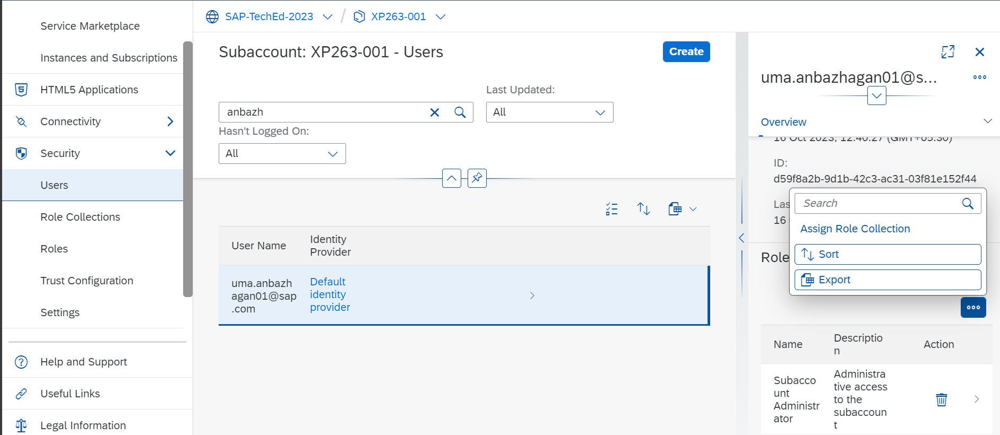
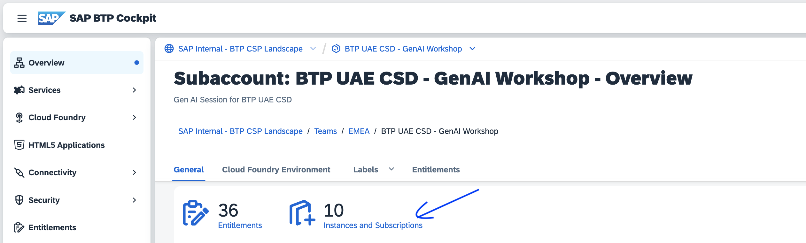
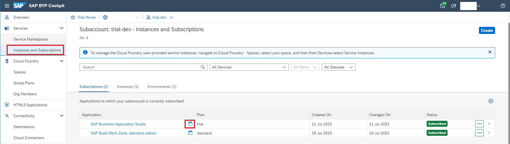
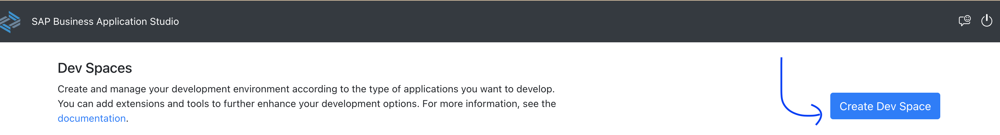
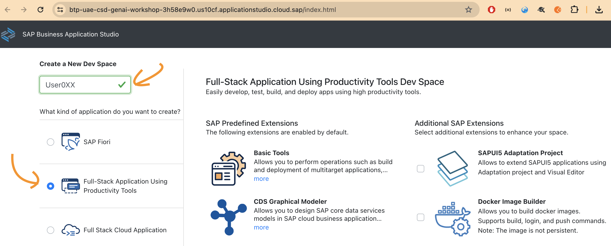
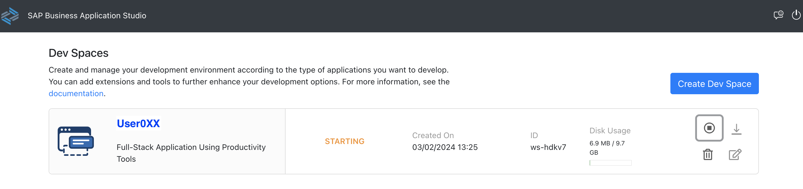
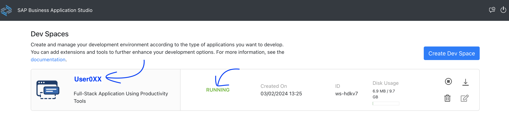
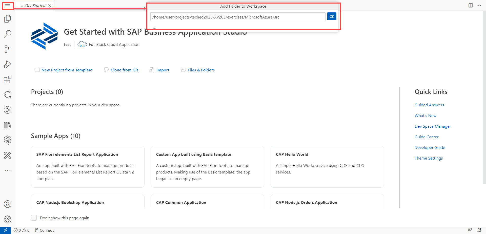

# EXERCISE 1. Reference Architecture of an SAP BTP CAP Application using LLMs on Microsoft Azure OpenAI via SAP Generative AI Hub

<!--## Prerequisites 

## Setting-Up SAP Business Application Studio (BAS) with Smart Converter Project

Search for your user under **Security -> Users**. Click on **...** to seelct Assign Role Collection, search for **Business_Application_Studio** and assign all the roles to your user.

  -->

1. Login into your [SAP BTP subaccount](https://emea.cockpit.btp.cloud.sap/cockpit?idp=ajsk93daf.accounts.ondemand.com#/globalaccount/CA50235469TID000000000741455808/subaccount/bb832256-7694-446c-8d97-3f7cdd1e2cd3/). 

2. Click the **Instance and Subscriptions** on the left menu.



3.  Click on the icon as shown in the screenshot below. It opens **Business Application Studio** in a new tab.

    

4. Click on **Create Dev Space**

        

4. Create a Space. For ex: **User0XX**. Replace **XX** with your user number.

    

3. When it’s ready, open your dev space by clicking on the name. 

    

    


4. In the menu in SAP Business Application Studio, select **Terminal** &rarr; **New Terminal**.
  
    

   Navigate to the projects folder by typing below in the terminal:

   ```bash
   cd projects
   ```

7. Clone the SAP CAP Application from the GitHub repository. 

   ```bash
   git clone https://github.com/SAP-samples/teched2023-XP263.git
   ```

8. Click **Menu->File** and then choose **Add Folder to Workspace** from the dropdown menu. Open the project by choosing/typing the below then clicking **Open**:
    ```bash
    /home/user/projects/teched2023-XP263/exercises/MicrosoftAzure/src
    ```

    
    
Continue to - [Exercise 2: API CAP Deployment ](../ex3.2/README.md) where you will deploy the backend API of the Smart CO2 Converter App.
