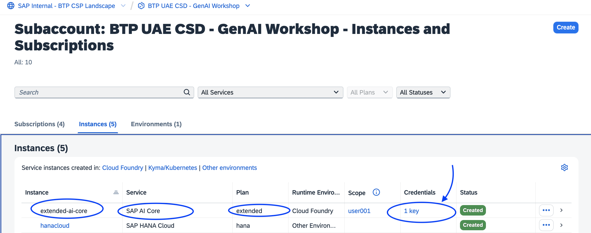
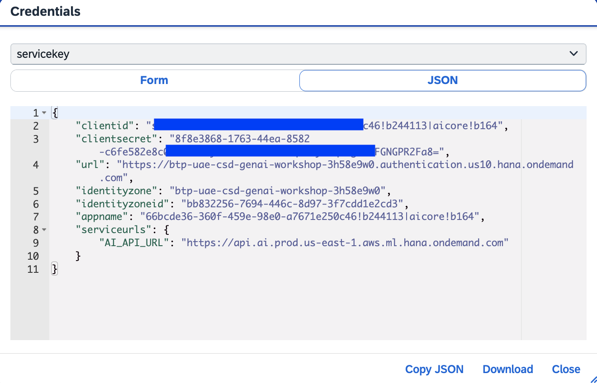

# EXERCISE 4. Fetch SAP Generative AI Hub Credentials

## Generative AI Hub in SAP AI Core
The generative AI hub incorporates large language models (LLMs) into your AI activities in SAP AI Core and
SAP AI Launchpad. LLMs are self-supervised, deep learning models that have been trained on vast amounts of unlabeled data. They leverage AI technology and industrial-scale computational resources to learn complex language patterns
and semantic knowledge bases for natural language processing (NLP) tasks. They parse input, such as prompts, and by predicting a target word, can return contextually relevant responses written in natural
language. A single LLM can perform multiple NLP tasks by using different input formats and output modes. LLMs are general models but can be fine-tuned with additional embeddings for specialized or domain-specific use cases.
SAP AI Core and the generative AI hub help you to integrate LLMs and AI into new business processes in a cost-efficient manner.

## Accessing Credentials
As of today, generative AI hub is available through BTP canary accounts only. From the below link, users will be able to understand for how to create their own instances of generative AI hub whence the service is available on all BTP sub-accounts.
Follow the step-by-step simulator by clicking the link below. The following credentials are needed to connect the service.

1. URL -> SAP AI Launchpad Deployment URL
2. tokenServiceURL -> from AI Core service key
3. clientId -> from AI Core service key
4. clientSecret -> from AI Core service key

Once you complete this, you will have the below details.

1.  `URL`: https://api.ai.prod.us-east-1.aws.ml.hana.ondemand.com/v2/inference/deployments/d75048b148e32f76

2.  `clientid`: sb-66bcde36-360f-459e-98e0-a7671e250c46!b244113|aicore!b164

3.  `clientsecret`: 8f8e3868-1763-44ea-8582-c6fe582e8c07$KMJ3cyMILnT_Koxw1Iwq5PlyLlqszgdfYFGNGPR2Fa8=

4.  `token url`: https://btp-uae-csd-genai-workshop-3h58e9w0.authentication.us10.hana.ondemand.com/oauth/token

Get **Clinet ID** and **Client secret** details from below BTP subaccount, as shown in below.

  

  

With these credentails, users will be able to connect to SAP generative AI hub by updating destination credentials from their SAP BTP cockpit as performd in [Exercise 5: Update Destination Credentials in BTP Sub-Account](../ex3.5/README.md).
